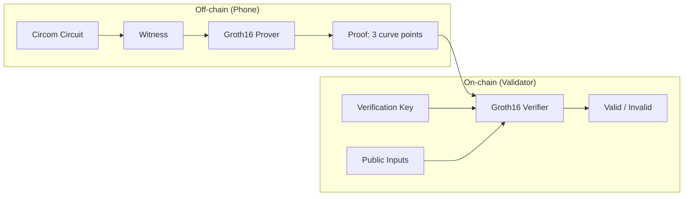
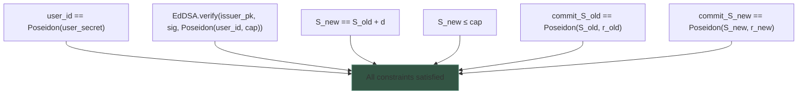
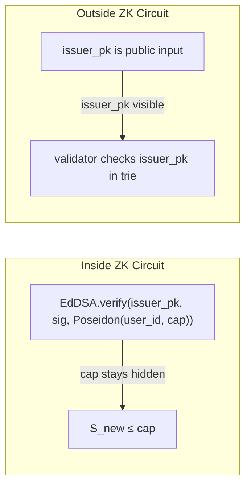

# Cryptography

## Proof System: Groth16 on BLS12-381

The ZK proof system is Groth16 targeting the BLS12-381 curve. Plutus V3 provides native BLS12-381 pairing builtins, making on-chain verification efficient (~25% of per-transaction CPU budget).

### Circuit Public Inputs

| Input | Type | Binds |
|-------|------|-------|
| `d` | integer | Spend amount (customer's choice) |
| `commit_S_old` | field element | Old counter commitment |
| `commit_S_new` | field element | New counter commitment |
| `user_id` | field element | `Poseidon(user_secret)` |
| `issuer_Ax`, `issuer_Ay` | field elements | Issuer card's Jubjub EdDSA public key (card that signed the cap certificate) |
| `pk_c_hi`, `pk_c_lo` | field elements | Customer's Ed25519 public key, split across two field elements (pass-through; bound by proof so the validator can cross-check the redeemer-supplied `customer_pubkey`) |

The acceptor card's Ed25519 public key is **not** a circuit public input. Its binding to the spend is achieved off-chain by the customer's Ed25519 signature over the redeemer's `signed_data`, verified on-chain via Plutus's `VerifyEd25519Signature` builtin. The validator additionally checks that `acceptor_pk` is a registered card in the coalition datum and that the transaction is signed by `acceptor_pk`.

### Circuit Private Inputs

| Input | Type | Known to |
|-------|------|----------|
| `S_old` | integer | User only |
| `S_new` | integer | User only (`= S_old + d`) |
| `cap` | integer | User + issuer |
| `r_old`, `r_new` | field elements | User only (commitment randomness) |
| `user_secret` | field element | User only |
| `sig_R8x`, `sig_R8y`, `sig_S` | field elements | User only (EdDSA signature components) |

### Circuit Constraints

## Signature Scheme: EdDSA-Poseidon on Jubjub (In-Circuit)

Cap certificates are signed using EdDSA with Poseidon hash on the Jubjub curve (twisted Edwards curve over the BLS12-381 scalar field). This signature is produced by the card's Jubjub EdDSA key and verified **inside** the ZK circuit.

| Parameter | Value |
|-----------|-------|
| Curve | Jubjub (a=-1, d=192570...) |
| Field | BLS12-381 scalar field |
| Hash | Poseidon (field-native, ~250 constraints per hash) |
| Subgroup order | 65544... (~254 bits) |
| Cofactor | 8 |
| In-circuit cost | ~7000 constraints per signature verification |

### Why EdDSA-Poseidon inside the circuit?

The issuer's signature on the cap certificate must be verified **inside the ZK proof** because `cap` is private. If the signature were verified outside, the verifier would need to see `cap`, breaking privacy.

### Why not verify signatures outside?

| Data | Inside circuit | Outside circuit |
|------|---------------|-----------------|
| Cap | Hidden (private input) | Would be revealed |
| Issuer pk | Passed through as public input | Checked by validator |
| Signature | Verified in circuit | Would need cap visible |

## Customer Signature: Ed25519 (Outside the Circuit)

Per-transaction binding of the spending data to a specific Cardano tx is handled **outside** the ZK proof by an Ed25519 signature the customer produces on their phone and includes in the Aiken redeemer. The validator verifies it with Plutus's `VerifyEd25519Signature` builtin.

| Field | Purpose |
|-------|---------|
| `sk_c`, `pk_c` | Customer's Ed25519 signing keypair, held on the phone alongside `user_secret` |
| `signed_data` | Canonical byte layout: `txid (32) ‖ ix (2) ‖ acceptor_pk (32) ‖ d (8)` — 74 bytes. `acceptor_pk` is the accepting card's Ed25519 public key |
| `customer_signature` | Ed25519 signature of `signed_data` under `sk_c` |

### Why Ed25519 outside instead of Poseidon inside?

- Avoids implementing Poseidon on-chain (no Aiken-native Poseidon-BLS12-381 library exists; cost is unknown).
- `VerifyEd25519Signature` is a Plutus builtin — cheap, vetted.
- `pk_c` is still bound by the Groth16 proof as a pass-through public input (`pk_c_hi`, `pk_c_lo`), so the reificator cannot substitute a different customer key after the fact.
- Replay, amount, and acceptor binding are all collapsed into one signature instead of needing a `nonce` circuit input + on-chain Poseidon check.

### Binding summary

| Binding | Mechanism |
|---------|-----------|
| `d` | Public input + circuit constraint `S_new = S_old + d` |
| `acceptor_pk` (card's Ed25519 key) | Ed25519 signature over `signed_data` + validator checks card is registered and tx is signed by it |
| TxOutRef / replay protection | Ed25519 signature + validator checks TxOutRef consumed in this tx |
| `user_id` | Public input + circuit proves `user_id = Poseidon(user_secret)` |
| `pk_c` | Public input (pass-through) + cross-checked against redeemer's `customer_pubkey` |

## Commitment Scheme: Poseidon Hash

`commit(v, r) = Poseidon(v, r)` — a hash-based commitment.

| Property | Guaranteed |
|----------|-----------|
| Binding | Cannot find different `(v', r')` with same hash |
| Hiding | Cannot determine `v` from `commit(v, r)` without `r` |
| Homomorphic | No — counter update proven inside circuit, not algebraically |

Poseidon is chosen because it is **field-native**: pure arithmetic over the BLS12-381 scalar field. No curve operations, no bit decomposition. ~250 constraints per hash, compared to ~25,000 for SHA-256 in a circuit.

## Trusted Setup

Groth16 requires a circuit-specific trusted setup (powers of tau ceremony + phase 2). One setup per circuit variant. The verification key is a parameter of the on-chain validator — one VK for the entire coalition.

Multi-certificate spend (N certificates) requires a different circuit with a separate trusted setup. The coalition chooses N at setup time.
