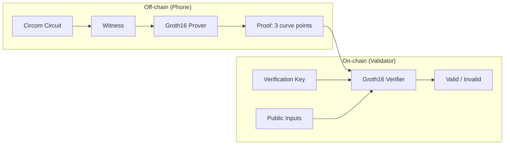
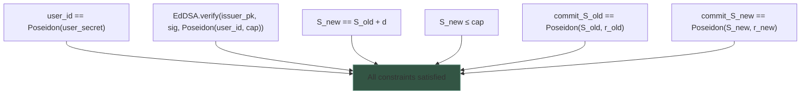
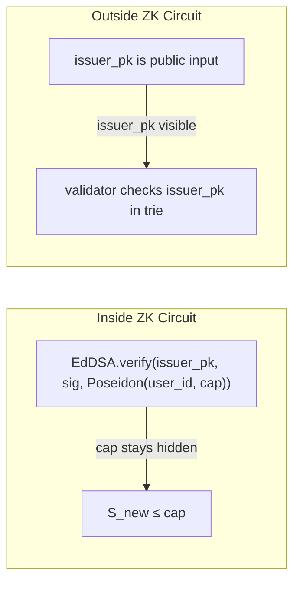

# Cryptography

## Proof System: Groth16 on BLS12-381

The ZK proof system is Groth16 targeting the BLS12-381 curve. Plutus V3 provides native BLS12-381 pairing builtins, making on-chain verification efficient (~25% of per-transaction CPU budget).

### Circuit Public Inputs

| Input | Type | Binds |
|-------|------|-------|
| `d` | integer | Spend amount (customer's choice) |
| `commit_S_old` | field element | Old counter commitment |
| `commit_S_new` | field element | New counter commitment |
| `user_id` | field element | `Poseidon(user_secret)` |
| `issuer_Ax`, `issuer_Ay` | field elements | Issuer's EdDSA public key (shop that signed the cap) |
| `acceptor_Ax`, `acceptor_Ay` | field elements | Acceptor's EdDSA public key (shop where the spend happens) |

### Circuit Private Inputs

| Input | Type | Known to |
|-------|------|----------|
| `S_old` | integer | User only |
| `S_new` | integer | User only (`= S_old + d`) |
| `cap` | integer | User + issuer |
| `r_old`, `r_new` | field elements | User only (commitment randomness) |
| `user_secret` | field element | User only |
| `sig_R8x`, `sig_R8y`, `sig_S` | field elements | User only (EdDSA signature components) |

### Circuit Constraints

## Signature Scheme: EdDSA-Poseidon on Jubjub

Certificates are signed using EdDSA with Poseidon hash on the Jubjub curve (twisted Edwards curve over the BLS12-381 scalar field).

| Parameter | Value |
|-----------|-------|
| Curve | Jubjub (a=-1, d=192570...) |
| Field | BLS12-381 scalar field |
| Hash | Poseidon (field-native, ~250 constraints per hash) |
| Subgroup order | 65544... (~254 bits) |
| Cofactor | 8 |
| In-circuit cost | ~7000 constraints per signature verification |

### Why EdDSA-Poseidon inside the circuit?

The issuer's signature on the cap certificate must be verified **inside the ZK proof** because `cap` is private. If the signature were verified outside, the verifier would need to see `cap`, breaking privacy.

### Why not verify signatures outside?

| Data | Inside circuit | Outside circuit |
|------|---------------|-----------------|
| Cap | Hidden (private input) | Would be revealed |
| Issuer pk | Passed through as public input | Checked by validator |
| Signature | Verified in circuit | Would need cap visible |

## Commitment Scheme: Poseidon Hash

`commit(v, r) = Poseidon(v, r)` — a hash-based commitment.

| Property | Guaranteed |
|----------|-----------|
| Binding | Cannot find different `(v', r')` with same hash |
| Hiding | Cannot determine `v` from `commit(v, r)` without `r` |
| Homomorphic | No — counter update proven inside circuit, not algebraically |

Poseidon is chosen because it is **field-native**: pure arithmetic over the BLS12-381 scalar field. No curve operations, no bit decomposition. ~250 constraints per hash, compared to ~25,000 for SHA-256 in a circuit.

## Trusted Setup

Groth16 requires a circuit-specific trusted setup (powers of tau ceremony + phase 2). One setup per circuit variant. The verification key is a parameter of the on-chain validator — one VK for the entire coalition.

Multi-certificate spend (N certificates) requires a different circuit with a separate trusted setup. The coalition chooses N at setup time.
