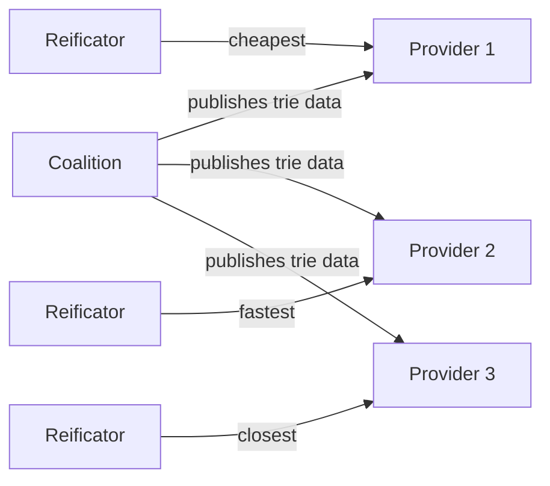

# Economics

## Cost Flow

```mermaid
graph TD
    SHOP[Shop] -->|funds UTXO| R[Reificator]
    R -->|tx fees| L1[On-Chain]
    R -->|query fees| DP[Data Provider]
    CO[Coalition] -->|publishes roots| OFF[Off-Chain Data]
    DP -->|reads| OFF
    DP -->|serves proofs| R

    style SHOP fill:#454,stroke:#898
    style R fill:#544,stroke:#988
    style L1 fill:#554,stroke:#998
    style DP fill:#435,stroke:#879
    style CO fill:#445,stroke:#889
    style OFF fill:#444,stroke:#888
```

## Who Pays for What

| Cost | Paid by | Frequency | Magnitude |
|------|---------|-----------|-----------|
| Settlement tx fee | Reificator (shop funds) | Per spend | ~0.2 ADA |
| Redemption tx fee | Reificator (shop funds) | Per redemption | ~0.2 ADA |
| Merkle proof query | Reificator (shop funds) | Per settlement + per redemption | Market-driven |
| Trie root publication | Coalition | Per block | Minimal (data hosting) |
| Reificator UTXO refill | Shop | Periodic | Proportional to usage |
| Revert tx fee | Shop (master key) | Rare (device failure) | ~0.2 ADA |
| ZK proof generation | User's phone (CPU) | Per spend | Free (local computation) |
| Topup | Nobody | Per reward | Free (off-chain certificate) |

## Transaction Economics

Every spend involves **two transactions**. Every topup involves **zero transactions**.

| Event | On-chain transactions | Off-chain operations |
|-------|----------------------|---------------------|
| Topup (5 euros reward) | 0 | 1 signature |
| Spend + settle (30 euros) | 1 (settlement) | 1 ZK proof + 1 Merkle query |
| Redeem (at shop) | 1 (redemption) | 1 Merkle query |
| Revert (device failure) | 1 (revert) | Shop decision |

**Why this works**: Topups are high-frequency, low-value — every purchase earns a few euros. Making them free is critical. Spends are low-frequency, high-value — redeeming 30-50 euros justifies two ~0.2 ADA transactions.

## Data Provider Market

Data providers serve Merkle proofs — anyone can run one. The data is public (published by the coalition). The proofs are verifiable (checked against the on-chain root). No trust required.

Providers compete on price, speed, and availability. Shops pick providers based on their needs. A reificator can switch providers at any time — the proofs are interchangeable.
