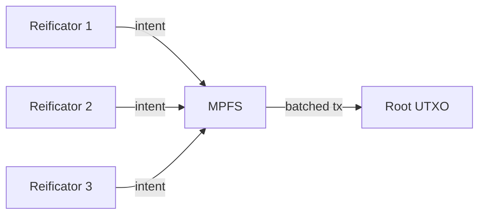
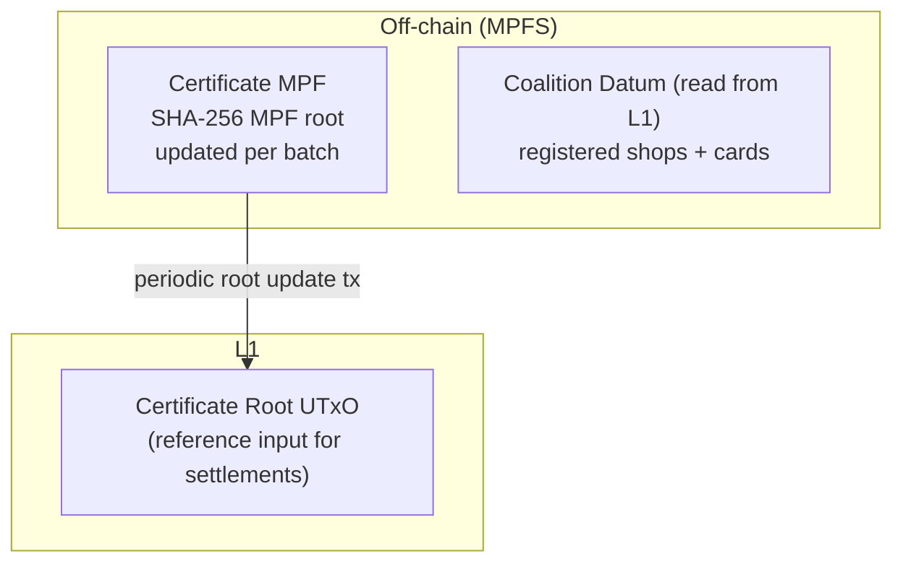

# On-Chain State

## Single UTXO, Three Tries + Certificate Root

All coalition state lives in a single UTXO containing a root hash. The full trie data lives off-chain, published by the coalition. Merkle proofs in transaction redeemers are verified against the on-chain root.

A separate reference-input UTxO holds the certificate root — the SHA-256 MPF root of all anchored certificates, updated periodically by the coalition via MPFS.

```mermaid
graph TD
    UTXO["Root UTXO<br/>hash(spend_root, reificator_root, pending_root)"]
    UTXO --> ST["Spend Trie<br/>(issuer, user_id) → commit(spent)"]
    UTXO --> RT["Reificator Trie<br/>shop_pk → reificator_pk"]
    UTXO --> PT["Pending Trie<br/>reificator_pk → nonce → {user_id, amount}"]

    CERT["Certificate Root UTxO (reference input)<br/>SHA-256 MPF root (32 bytes)"]

    style UTXO fill:#554,stroke:#998
    style ST fill:#354,stroke:#698
    style RT fill:#454,stroke:#898
    style PT fill:#543,stroke:#986
    style CERT fill:#446,stroke:#88a
```



### Spend Trie

Tracks cumulative spending per user per issuer.

| Key | Value |
|-----|-------|
| `(issuer_pk, user_id)` | `commit(spent) = Poseidon(spent, randomness)` |

- Absent key → spent = 0 (first spend uses non-membership proof)
- Value is a commitment — hides the actual spent total
- Updated by settlement transactions (counter goes up) and revert transactions (counter goes down)

### Reificator Trie

Authorized devices, managed by shops.

| Key | Value |
|-----|-------|
| `shop_pk` → `reificator_pk` | present/absent |

- The validator checks this trie to verify a reificator belongs to a shop
- Shops add entries when installing devices
- Shops remove entries to revoke stolen/decommissioned devices
- Coalition adds shop entries at onboarding

### Pending Trie

Committed-but-unredeemed spends.

| Key | Value |
|-----|-------|
| `(reificator_pk, nonce)` | `{user_id, amount}` |

- Inserted by settlement transactions
- Removed by redemption transactions (happy path) or revert transactions (recovery)
- Indexed by reificator so the shop can enumerate all pending entries for a stolen device

## Transaction Types

### Settlement Transaction

Submitted by a reificator (via MPFS). Consumes the root UTXO, outputs a new one. References the certificate root UTxO.

```
Inputs:  root UTXO + reificator fee UTXO
Reference inputs: certificate root UTxO
Redeemer: ZK proof + Merkle proof (spend trie) + MPF proof (certificate root)
          + certificate_id
Outputs: new root UTXO (updated spend trie + pending trie)

Validator checks:
  1. Groth16 proof valid against public inputs
     [d, commit_old, commit_new, user_id, issuer_pk, acceptor_pk, pk_c_hi, pk_c_lo, certificate_id]
  2. issuer_pk is a registered shop (reificator trie membership)
  3. reificator_pk is registered under acceptor_pk (reificator trie membership)
  4. Merkle proof valid against current spend trie root
  5. New root computed correctly from trie updates
  6. certificate_id has valid MPF membership proof against
     certificate root (from reference input)
  7. certificate_id matches the circuit's public input at index 8
```

### Redemption Transaction

Submitted by a reificator (via MPFS). Removes a pending entry.

```
Inputs:  root UTXO + reificator fee UTXO
Redeemer: nonce + reificator signature
Outputs: new root UTXO (pending trie entry removed)

Validator checks:
  1. Pending entry exists for (reificator_pk, nonce)
  2. Reificator signature valid
  3. New root computed correctly
```

### Revert Transaction

Submitted by the shop's master key (via MPFS). Rolls back a pending spend.

```
Inputs:  root UTXO + shop fee UTXO
Redeemer: nonce + shop master key signature
Outputs: new root UTXO (pending entry removed + spend trie rolled back)

Validator checks:
  1. Pending entry exists for (reificator_pk, nonce)
  2. reificator_pk is registered under shop_pk
  3. Shop signature valid (master key)
  4. Spend trie correctly rolled back by the pending entry's amount
  5. New root computed correctly
```

### Certificate Root Update Transaction

Submitted by the coalition periodically. Updates the certificate root with the latest MPF root from MPFS batching.

```
Inputs:  current certificate root UTxO + coalition fee UTxO
Outputs: new certificate root UTxO (updated MPF root)

Validator checks:
  1. Input is the current certificate root UTxO
  2. Output at the same address with updated MPF root
  3. Transaction signed by the coalition
```

The previous certificate root remains active until the update tx confirms — no gap in service. The frequency of updates is an operational choice trading L1 fees against confirmation latency.

## UTXO Contention

Every transaction touches the same root UTXO. Concurrent submissions from different reificators contend on this UTXO. MPFS handles this: reificators submit intents, MPFS batches and sequences them into transactions that update the root atomically.



## Off-Chain State (MPFS)

The full certificate MPF is managed off-chain by MPFS. Reificators submit topup intents; MPFS validates them (card registered, Jubjub key matches shop), chains MPF inserts into batches, and periodically updates the certificate root on L1.



MPFS handles the same contention problem for certificate batching as it does for L1 settlements — reificators submit intents, MPFS sequences them. The certificate MPF and the L1 trie root are independent UTxOs with zero cross-contention.
