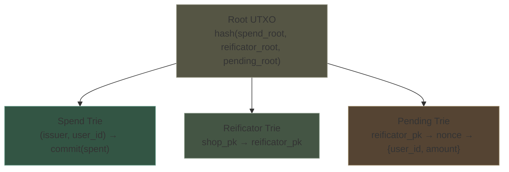
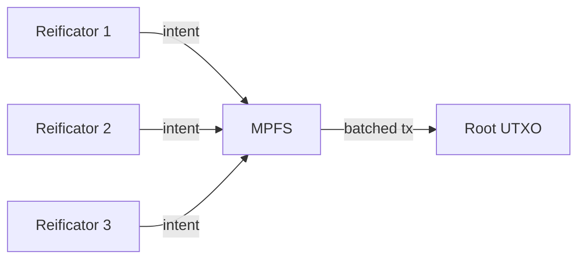

# On-Chain State

## Single UTXO, Three Tries

All coalition state lives in a single UTXO containing a root hash. The full trie data lives off-chain, published by the coalition. Merkle proofs in transaction redeemers are verified against the on-chain root.



### Spend Trie

Tracks cumulative spending per user per issuer.

| Key | Value |
|-----|-------|
| `(issuer_pk, user_id)` | `commit(spent) = Poseidon(spent, randomness)` |

- Absent key → spent = 0 (first spend uses non-membership proof)
- Value is a commitment — hides the actual spent total
- Updated by settlement transactions (counter goes up) and revert transactions (counter goes down)

### Reificator Trie

Authorized devices, managed by shops.

| Key | Value |
|-----|-------|
| `shop_pk` → `reificator_pk` | present/absent |

- The validator checks this trie to verify a reificator belongs to a shop
- Shops add entries when installing devices
- Shops remove entries to revoke stolen/decommissioned devices
- Coalition adds shop entries at onboarding

### Pending Trie

Committed-but-unredeemed spends.

| Key | Value |
|-----|-------|
| `(reificator_pk, nonce)` | `{user_id, amount}` |

- Inserted by settlement transactions
- Removed by redemption transactions (happy path) or revert transactions (recovery)
- Indexed by reificator so the shop can enumerate all pending entries for a stolen device

## Transaction Types

### Settlement Transaction

Submitted by a reificator (via MPFS). Consumes the root UTXO, outputs a new one.

```
Inputs:  root UTXO + reificator fee UTXO
Redeemer: ZK proof + Merkle proof (membership or non-membership in spend trie)
Outputs: new root UTXO (updated spend trie + pending trie)

Validator checks:
  1. Groth16 proof valid against public inputs [d, commit_old, commit_new, user_id, issuer_pk, shop_pk]
  2. issuer_pk is a registered shop (reificator trie membership)
  3. reificator_pk is registered under shop_pk (reificator trie membership)
  4. Merkle proof valid against current spend trie root
  5. New root computed correctly from trie updates
```

### Redemption Transaction

Submitted by a reificator (via MPFS). Removes a pending entry.

```
Inputs:  root UTXO + reificator fee UTXO
Redeemer: nonce + reificator signature
Outputs: new root UTXO (pending trie entry removed)

Validator checks:
  1. Pending entry exists for (reificator_pk, nonce)
  2. Reificator signature valid
  3. New root computed correctly
```

### Revert Transaction

Submitted by the shop's master key (via MPFS). Rolls back a pending spend.

```
Inputs:  root UTXO + shop fee UTXO
Redeemer: nonce + shop master key signature
Outputs: new root UTXO (pending entry removed + spend trie rolled back)

Validator checks:
  1. Pending entry exists for (reificator_pk, nonce)
  2. reificator_pk is registered under shop_pk
  3. Shop signature valid (master key)
  4. Spend trie correctly rolled back by the pending entry's amount
  5. New root computed correctly
```

## UTXO Contention

Every transaction touches the same root UTXO. Concurrent submissions from different reificators contend on this UTXO. MPFS handles this: reificators submit intents, MPFS batches and sequences them into transactions that update the root atomically.


