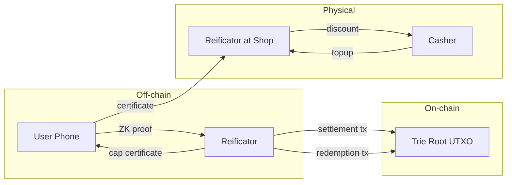

# Cardano Vouchers

A loyalty coalition protocol on Cardano. Multiple businesses form a coalition, each issuing voucher certificates to customers. Customers spend vouchers at any coalition member using zero-knowledge proofs.

One wallet, every loyalty program.

## Why a coalition?

New members get instant foot traffic on day one — existing coalition users walk in and spend vouchers before the new member has issued a single certificate. Every redemption is a real sale. The coalition is the growth flywheel.

## How it works

Earning is off-chain (a signed certificate). Spending is on-chain (a Groth16 proof). Redeeming is physical (a screen lights up). Three domains, one protocol.

## Documentation

- [**Semantics**](protocol/semantics.md) — precise definitions of every term in the protocol
- [**Actors**](protocol/actors.md) — who participates and what they control
- [**Lifecycle**](protocol/lifecycle.md) — step-by-step protocol walkthrough with diagrams
- [**Security**](protocol/security.md) — threat model, cryptographic guarantees, attack analysis
- [**On-Chain State**](architecture/on-chain.md) — three tries, UTXO structure, transaction types
- [**Cryptography**](architecture/cryptography.md) — when signatures suffice, when ZK is needed
- [**Economics**](architecture/economics.md) — who pays for what
