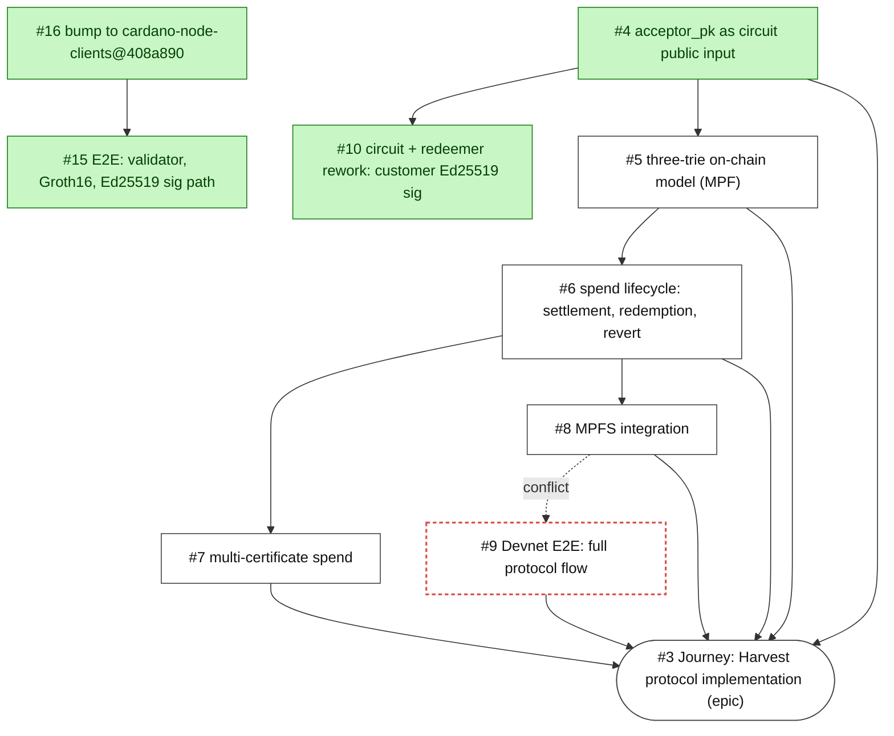
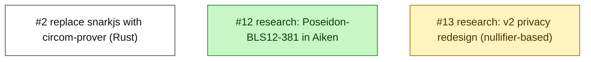

# Harvest — Journey Dependency Graph

Generated 2026-04-20 from GitHub issue dependency edges in
`lambdasistemi/harvest`. Green = closed. White = open. Arrows point
in the direction **"must happen before"** — `A → B` reads "`A` blocks
`B`".

## Main journey (rooted at the tracker issue #3)



The dashed red edge `#8 → #9` is the **declared** blocker in GitHub,
but the current `003-devnet-full-flow` spec (this branch) explicitly
skips it — matching the path #15 took — and flags it as the top
`/speckit.clarify` topic.

## Parallel / side tracks



These three have no `blockedBy` / `blocking` edges. They are
independent workstreams and can be picked up without affecting the
main journey.

## Current state summary

| Status | Issues |
|---|---|
| **Merged** | #4, #10, #12 (research), #15, #16 |
| **In flight** | #9 (this branch `003-devnet-full-flow`) |
| **Open, next natural steps** | #5 (three-trie), #6 (lifecycle), #7 (multi-cert), #8 (MPFS) |
| **Side tracks** | #2 (prover rewrite), #13 (v2 privacy research) |
| **Tracker** | #3 |

## Where we are right now

```
#4 ✓ → #10 ✓ → #15 ✓  (single-spend E2E delivered)
            ↓
            #16 ✓ (dep bump — done during #15)
            ↓
#9 ◐ (in progress on this branch; spec pushed, plan next)
```

Everything downstream of the ledger work (`#5 three-trie` →
`#6 lifecycle` → `#7 multi-cert` / `#8 MPFS`) is still un-scoped in
code. `#9` cuts a horizontal slice — the full protocol flow end-to-
end — that exercises parts of #6 (settlement/redemption/revert
semantics) without waiting for the three-trie ledger implementation
(#5) to land. That's the deliberate scope decision captured as
FR-013/FR-014 in the spec.
