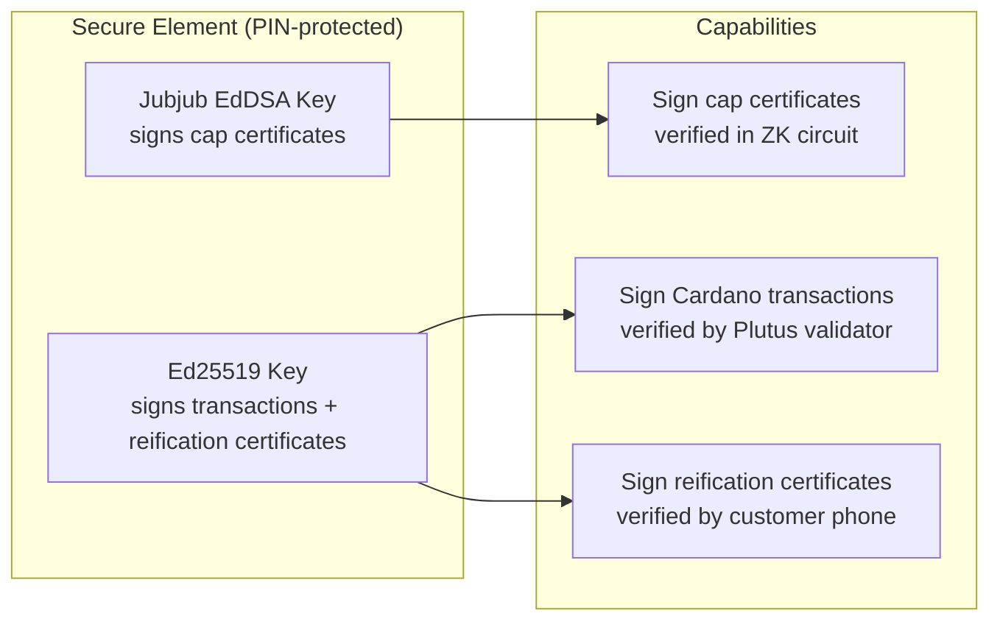
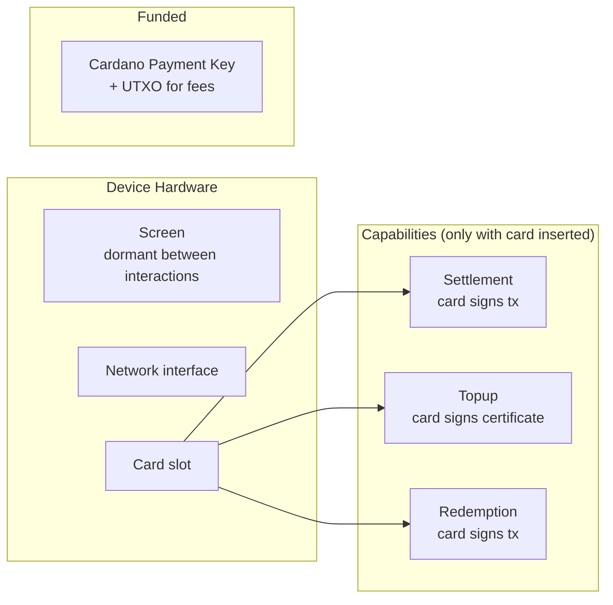
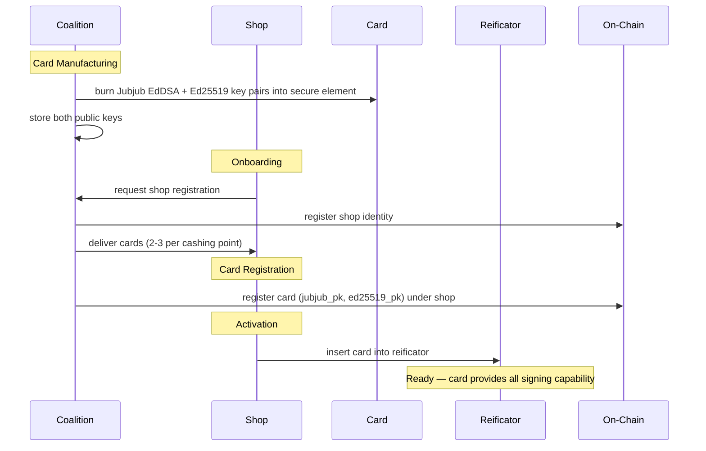

# Actors

## Trust Relationships

```mermaid
graph TD
    CO[Coalition] -->|manufactures| CD[Card]
    CO -->|registers| S[Shop]
    S -->|inserts card into| R[Reificator]
    CD -->|signs certificates + transactions| R
    R -->|settles proofs| L1[On-Chain]
    R -->|queries| DP[Data Provider]
    U[User] -->|sends proofs to| R
    U -->|redeems at| R
    C[Casher] -->|operates| R
    DP -->|serves Merkle proofs from| L1

    style CO fill:#445,stroke:#889
    style S fill:#454,stroke:#898
    style CD fill:#534,stroke:#978
    style R fill:#544,stroke:#988
    style U fill:#345,stroke:#689
    style C fill:#453,stroke:#896
    style DP fill:#435,stroke:#879
    style L1 fill:#554,stroke:#998
```

## Coalition

Creates the protocol infrastructure. Minimal ongoing authority.

| Power | Constraint |
|-------|-----------|
| Create on-chain state (three tries) | One-time |
| Manufacture cards (burn key pairs into secure element) | Cards distributed to shops |
| Register shops and cards on-chain | On request |
| Remove shops | Requires multi-sig from other shops |

The coalition **cannot**: alter spend state, access user data, forge certificates, submit transactions on behalf of shops, or unilaterally remove members.

## Shop

A business in the coalition. Sovereign once onboarded.

| Has | Purpose |
|-----|---------|
| Cards (2-3 per cashing point) | Sign certificates and transactions via secure element |
| Master key (held separately, never on any device) | Revert pending entries after device loss/theft |
| Fleet of reificators | Physical cashing points (commodity hardware) |

The shop receives cards from the coalition. One card is inserted into a reificator to activate it. Spare cards are kept in a safe. The master key is the recovery authority — it can revert pending entries but cannot sign certificates or submit settlements.

### Role terminology: issuer vs acceptor

In a given spend transaction, one card plays the **issuer** role (signed the cap certificate) and one card plays the **acceptor** role (its reificator submits the proof). Issuer and acceptor can be cards at the same shop or different shops — these are per-transaction role labels, not separate actor types. The circuit's public inputs include the issuer card's Jubjub key (`issuer_Ax`, `issuer_Ay`). The customer's `signed_data` includes the acceptor card's Ed25519 key (`acceptor_pk`).

## Card

A PIN-protected smart card with a secure element. The shop's complete identity.

| Property | Value |
|----------|-------|
| Secure element | Two key pairs (Jubjub EdDSA + Ed25519), PIN-protected |
| PIN lockout | N failed attempts → permanently locked |
| Distribution | Manufactured by coalition, 2-3 per shop |
| Spare cards | Kept in shop's safe, same shop different keys |
| On-chain registration | Both public keys registered as a pair under a shop |

## Reificator

A stateless commodity hardware device. Inert without a card.

| Property | Value |
|----------|-------|
| State | None — all state is on-chain |
| Screen | Dormant between interactions, lights up for reification |
| Background | Continuously settles proofs on-chain (only while card is inserted) |
| Identity keys | None — all signing delegated to the inserted card |
| Payment key | Cardano payment key + UTXO (for transaction fees only) |
| Interchangeable | A shop's card works in any compatible reificator |

## User

Anonymous. No registration, no identity beyond `Poseidon(user_secret)`.

| Holds (on phone) | Purpose |
|-------------------|---------|
| `user_secret` | Proves identity in ZK proofs |
| Ed25519 keypair (`sk_c`, `pk_c`) | Signs per-tx authorisation (`acceptor_pk`, TxOutRef, `d`) for the validator's Ed25519 check |
| Spend randomness (`r_old`, `r_new`) | Opens commitments |
| Cap certificates (per shop) | Proves spending allowance |
| Reification certificates (per spend) | Redeems at cashing points |

The user **never** interacts with the blockchain. The phone generates proofs, the reificator submits them.

## Key Ceremony

The reificator has no keys burned in. All identity and signing capability comes from the card. Device breaks? Plug the card into a new reificator. No re-registration needed.
