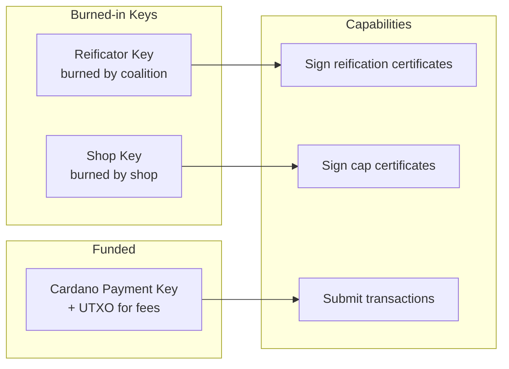
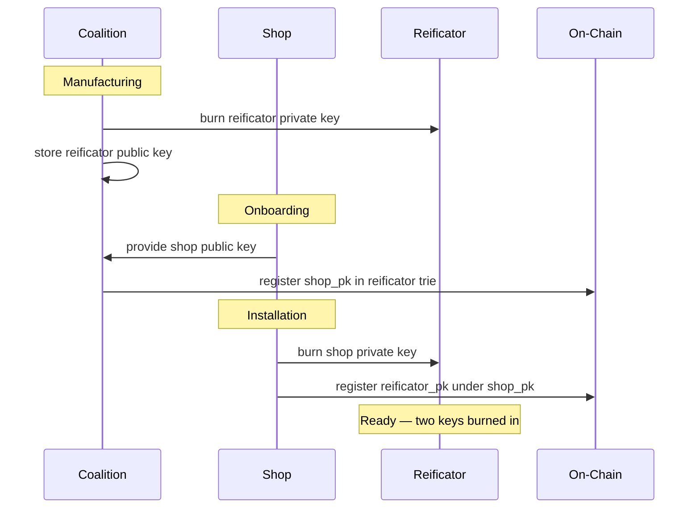

# Actors

## Trust Relationships

```mermaid
graph TD
    CO[Coalition] -->|manufactures| R[Reificator]
    CO -->|registers| S[Shop]
    S -->|burns shop key| R
    S -->|signs cap certificates via| R
    R -->|settles proofs| L1[On-Chain]
    R -->|queries| DP[Data Provider]
    U[User] -->|sends proofs to| R
    U -->|redeems at| R
    C[Casher] -->|operates| R
    DP -->|serves Merkle proofs from| L1

    style CO fill:#445,stroke:#889
    style S fill:#454,stroke:#898
    style R fill:#544,stroke:#988
    style U fill:#345,stroke:#689
    style C fill:#453,stroke:#896
    style DP fill:#435,stroke:#879
    style L1 fill:#554,stroke:#998
```

## Coalition

Creates the protocol infrastructure. Minimal ongoing authority.

| Power | Constraint |
|-------|-----------|
| Create on-chain state (three tries) | One-time |
| Manufacture reificators (burn reificator key) | No access to shop keys |
| Register shops (add shop_pk to trie) | On request |
| Remove shops | Requires multi-sig from other shops |

The coalition **cannot**: alter spend state, access user data, forge certificates, submit transactions on behalf of shops, or unilaterally remove members.

## Shop

A business in the coalition. Sovereign once onboarded.

| Has | Purpose |
|-----|---------|
| Key pair (`shop_pk`, `shop_sk`) | Sign cap certificates; identify the shop on-chain |
| Master key (held separately) | Revert pending entries after device loss |
| Fleet of reificators | Physical cashing points |

The shop key is burned into reificators at installation. The master key is **never** on a device — it's the recovery authority.

### Role terminology: issuer vs acceptor

Every coalition member is a **Shop** with a single key pair (`shop_pk`, `shop_sk`). In a given spend transaction, one shop plays the **issuer** role (signed the cap certificate) and one shop plays the **acceptor** role (its reificator submits the proof and its counter is updated). Issuer and acceptor can be the same shop or different shops — these are per-transaction role labels, not separate actor types. The circuit's public inputs refer to `issuer_pk` and `acceptor_pk`, both of which are `shop_pk` values of coalition members.

## Reificator

A stateless secure hardware device.

| Property | Value |
|----------|-------|
| State | None — all state is on-chain |
| Screen | Dormant between interactions, lights up for reification |
| Background | Continuously settles proofs on-chain |
| Keys | Reificator key + shop key + payment key |

## User

Anonymous. No registration, no identity beyond `Poseidon(user_secret)`.

| Holds (on phone) | Purpose |
|-------------------|---------|
| `user_secret` | Proves identity in ZK proofs |
| Ed25519 keypair (`sk_c`, `pk_c`) | Signs per-tx authorisation (`acceptor_pk`, TxOutRef, `d`) for the validator's Ed25519 check |
| Spend randomness (`r_old`, `r_new`) | Opens commitments |
| Cap certificates (per shop) | Proves spending allowance |
| Reification certificates (per spend) | Redeems at cashing points |

The user **never** interacts with the blockchain. The phone generates proofs, the reificator submits them.

## Key Ceremony

Two keys, two authorities, two ceremonies. Neither authority can impersonate the other.
