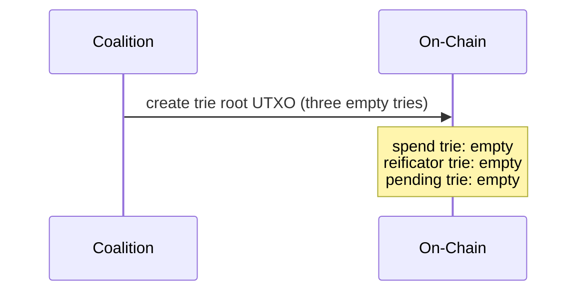
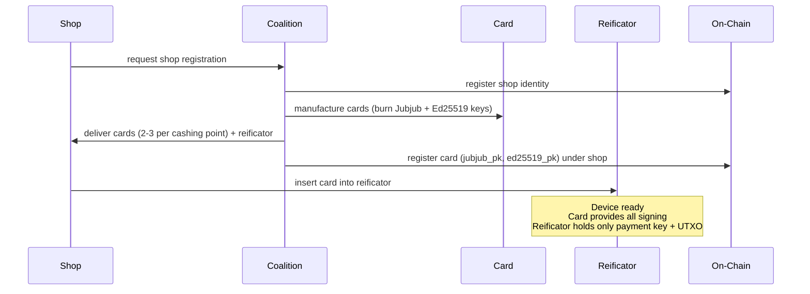
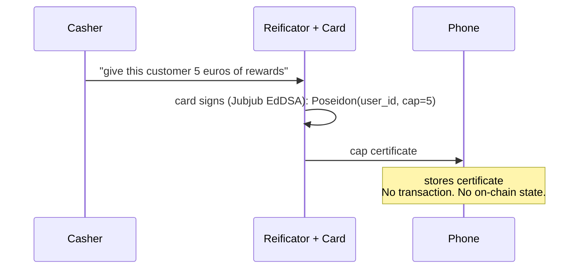
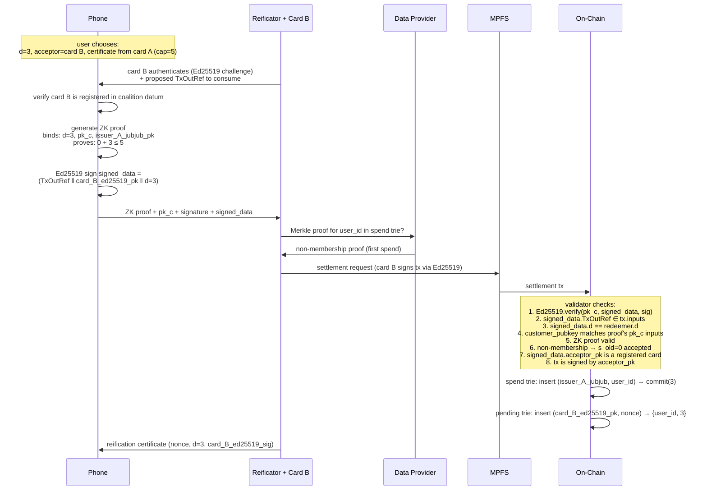
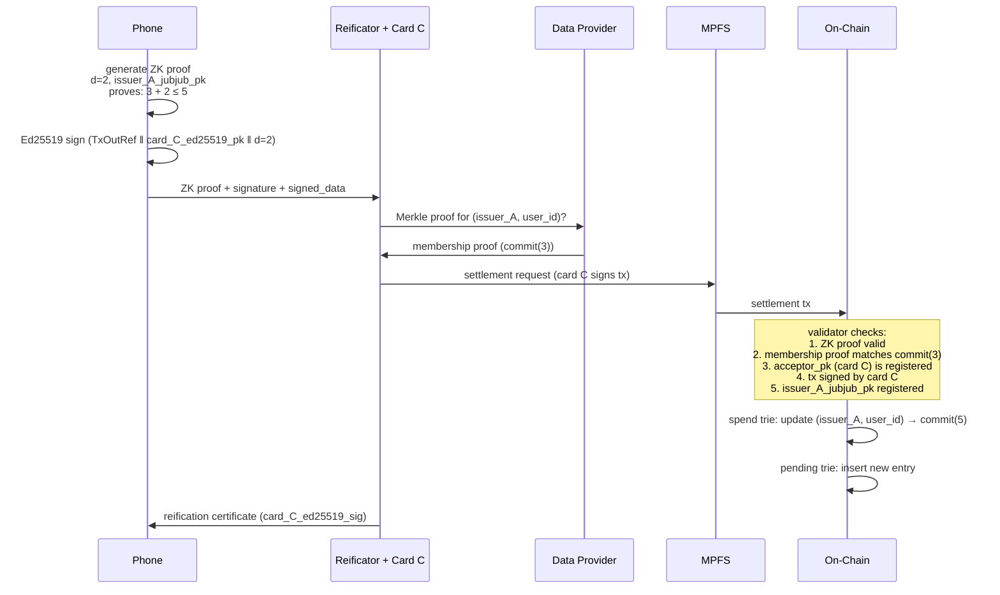
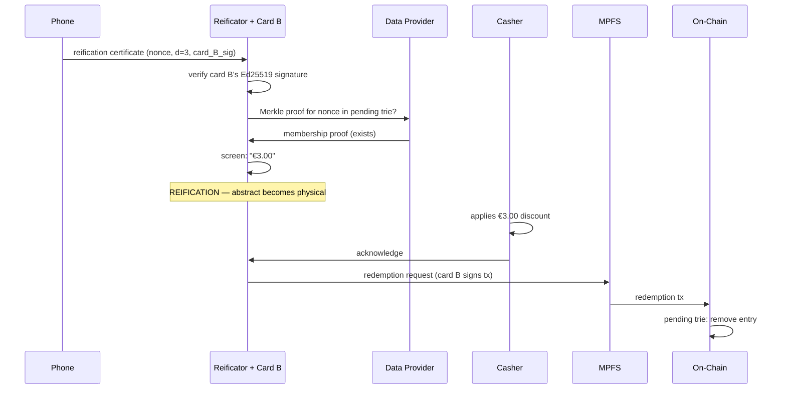
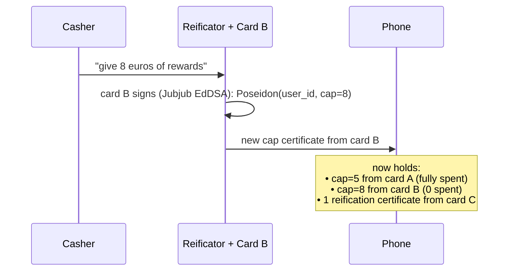
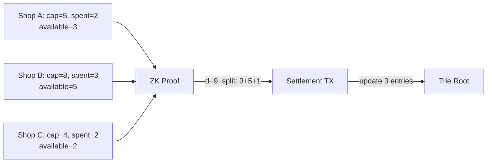

# Lifecycle

A complete walkthrough of the protocol from coalition creation to a multi-certificate spend.

## Phase 1: Coalition Formation

Anyone with the will to distribute reificators can create a coalition. The coalition's power is limited to manufacturing devices and registering shops.

## Phase 2: Shop Onboarding

The shop funds the reificator's UTXO with ADA for transaction fees and data provider queries. Each card's Ed25519 public key derives a Cardano address visible in the coalition datum — the shop knows exactly which address to top up.

## Phase 3: Customer Enrollment

There is no enrollment. The user installs the app, which generates a random `user_secret`. That's it.

`user_id = Poseidon(user_secret)` — the user exists.

No registration, no account, no on-chain footprint until the first spend.

## Phase 4: First Topup

The relationship between user and shop is a signed certificate on a phone. Nothing else. The card must be inserted for topup — the reificator alone cannot produce certificates.

## Phase 5: First Spend (Settlement)

The user is at home. They decide to spend 3 euros using shop A's card certificate.

Note: the **issuer** (card A at shop A, which signed the cap certificate) and the **acceptor** (card B at shop B, whose reificator submits) are different cards, potentially at different shops. Both are cards registered in the coalition — "issuer" and "acceptor" are role labels for this transaction, not separate actor types. This is the coalition model.

## Phase 6: Subsequent Spend

The user wants to spend 2 more euros from the same certificate (cap=5, already spent 3).

The user is now at cap (spent=5, cap=5). Further spends from this certificate fail the range check.

## Phase 7: Physical Redemption

The user has two reification certificates — one from card B's reificator, one from card C's. They visit shop B (card B inserted).

## Phase 8: Topup at Redemption

Same interaction continues — the casher rewards the customer. Card B must be inserted.

No transaction. The customer walks away with new earning potential at shop B.

## Phase 9: Multi-Certificate Spend (Future)

The user has small balances across several shops — 3 euros at A, 5 at B, 2 at C. None is enough alone for a 9 euro purchase. With multi-certificate spend:

One proof, multiple certificates, atomic update. The circuit verifies N issuer signatures and proves each partial spend stays within its cap.
