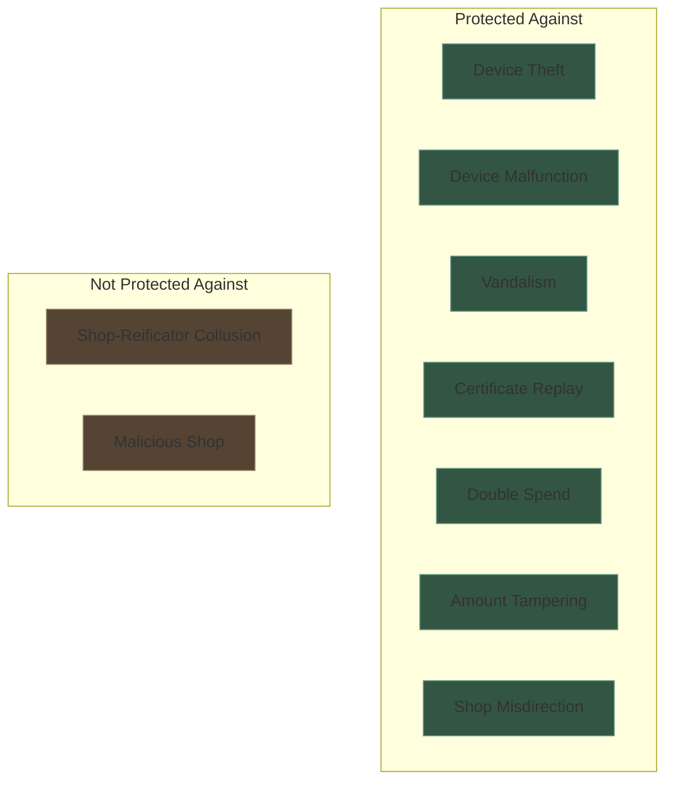
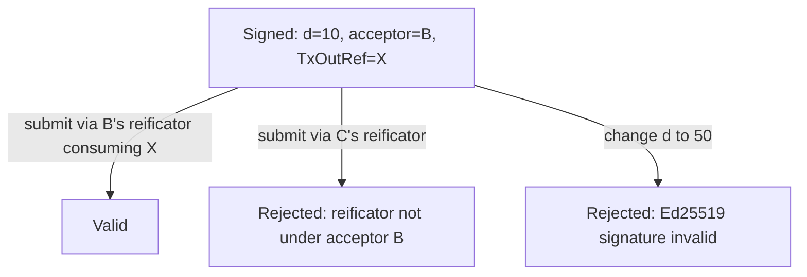
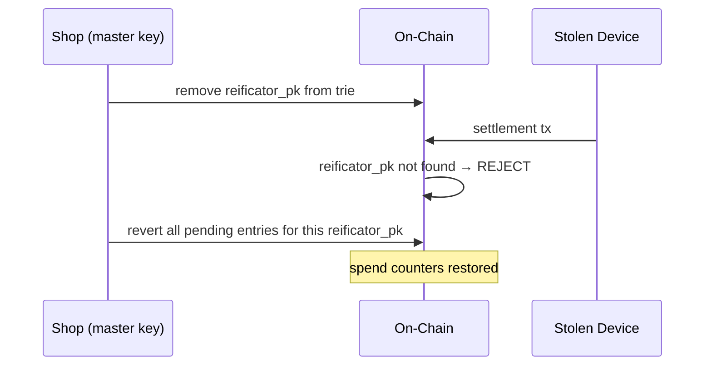
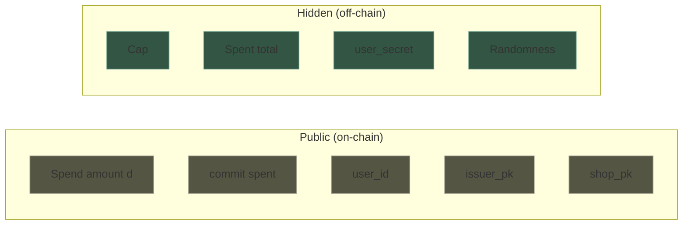

# Security

## Threat Model

The protocol protects against **device failure** — malfunction, theft, vandalism. It does **not** protect against malicious shops. The shop is assumed cooperative: it has every incentive to serve its customers.

## Cryptographic Guarantees

### What requires a ZK proof?

Operations where **private data must remain hidden** while proving a statement about it.

| Assertion | Private inputs | Mechanism |
|-----------|---------------|-----------|
| `s_old + d ≤ cap` | `s_old`, `cap`, randomness | ZK proof (Groth16) |
| Certificate is valid (issuer signed it) | `cap`, `nonce` | ZK proof (EdDSA verified inside circuit) |
| User is who they claim | `user_secret` | ZK proof (`user_id = Poseidon(user_secret)`) |

### What requires only a signature?

Operations where **authorization** is needed but nothing is hidden.

| Assertion | Signer | Mechanism |
|-----------|--------|-----------|
| "User X may spend up to cap C" | Shop (issuer) | EdDSA signature (verified inside ZK circuit) |
| "Amount d settled, nonce N" | Reificator | EdDSA signature (verified at redemption) |
| "Nonce N is redeemed" | Reificator | Transaction signature |
| "Nonce N is reverted" | Shop (master key) | Transaction signature |
| "Reificator R is authorized" | Shop | On-chain trie entry |

### What needs no cryptography?

| Operation | Why |
|-----------|-----|
| Topup | Off-chain certificate, signed by shop key already on the device |
| Casher acknowledges discount | Physical act, no cryptographic role |

## Attack Analysis

### Double spend / proof replay

**Attack**: Reificator submits the same proof in a second transaction.

**Defense**: The customer's Ed25519 signature in the redeemer covers a specific `TxOutRef` the reificator consumes in this transaction. A TxOutRef can be consumed at most once on-chain — the second submission has no matching unspent input, and the validator rejects. The circuit's commitment chain (`commit_S_old` must match the current on-chain value) adds a second layer: after one successful spend, `commit_S_old` has moved forward and the proof no longer validates against the datum.

### Amount tampering

**Attack**: Reificator changes the spend amount `d` before submitting.

**Defense**: `d` is a public input to the ZK proof. Changing `d` invalidates the proof. The redeemer additionally cross-checks `signed_data.d == redeemer.d` against the customer's Ed25519 signature.

### Acceptor misdirection

**Attack**: Reificator from acceptor A submits a proof intended for acceptor B.

**Defense**: The customer's Ed25519 signature covers `acceptor_pk` inside `signed_data`. Changing `acceptor_pk` invalidates the signature. The validator also checks (milestone 2) that the submitting reificator is registered under `signed_data.acceptor_pk` in the reificator trie.

### Customer-key substitution

**Attack**: Reificator captures a customer's proof and signs a redeemer with a different customer key.

**Defense**: The customer's `pk_c` is a pass-through public input to the Groth16 proof (`pk_c_hi`, `pk_c_lo`). The validator cross-checks the redeemer's `customer_pubkey` matches the proof's `pk_c` inputs. Substituting a different customer key invalidates the proof.

### Stolen reificator

**Attack**: Someone steals a reificator and tries to use it.

**Defense**: The stolen device can submit transactions (it has keys), but:

1. The shop revokes the reificator's public key from the on-chain trie.
2. After revocation, no settlement tx from this device is accepted (trie lookup fails).
3. The shop reverts all pending entries for the stolen reificator using its master key.
4. Customer spend counters are restored.

### Reificator malfunction

**Attack**: Device settles a proof on-chain but crashes before returning the reification certificate.

**Defense**: The pending trie entry exists on-chain — evidence that the settlement happened. The customer contacts the shop. The shop checks the pending trie, sees the unredeemed entry, and reverts it with the master key. Customer's counter is restored.

### Phone loss

**Impact**: All certificates lost. `user_secret` lost.

**Defense**: None — this is a total loss, same as losing a crypto wallet seed. The user should back up `user_secret` (it's one field element, encodable as a passphrase).

On-chain state persists (spend counters), but without `user_secret` the user cannot generate new proofs. The spent points are unrecoverable.

## Privacy Properties

| Observer | Learns | Does not learn |
|----------|--------|---------------|
| On-chain observer | `d`, `user_id`, `issuer_pk`, `acceptor_pk` (via signed_data), `commit(spent)`, `pk_c` | Cap only; `S_old`/`S_new` are derivable by aggregating public `d` values |
| Issuer (shop that signed the cap) | Cap they signed, user_id | Other shops' caps, total spent, when/where redeemed |
| Acceptor (shop where the spend happens) | Amount `d` being redeemed | Cap, total spent, which shop issued the certificate |
| Data provider | Trie structure, entry existence | Nothing beyond what's on-chain |
