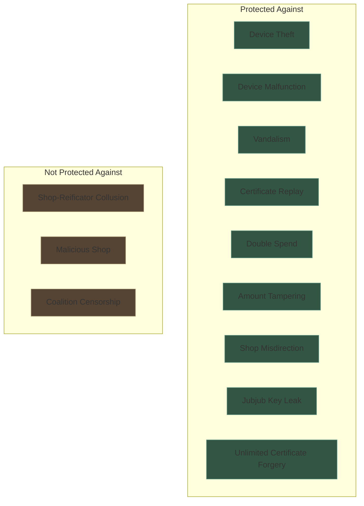
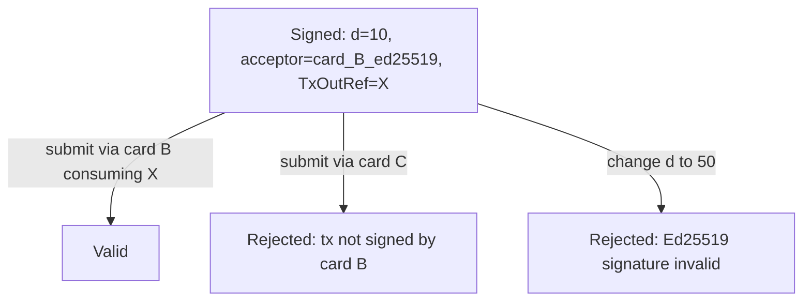
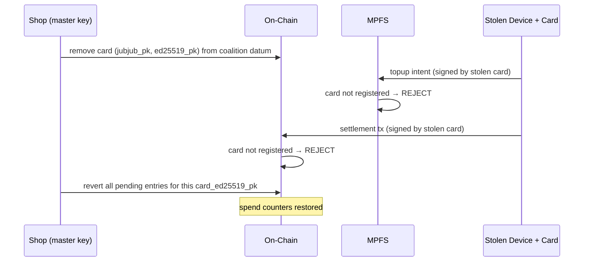
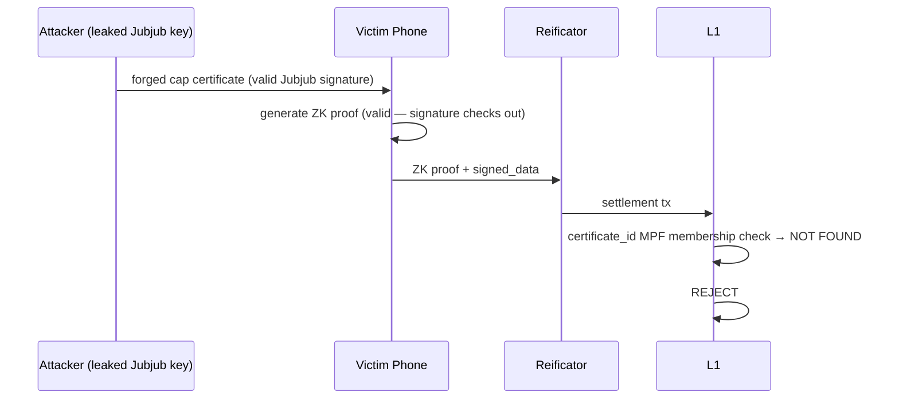
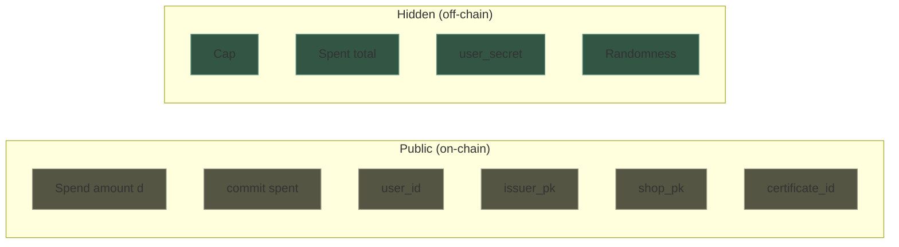

# Security

## Threat Model

The protocol protects against **device failure** — malfunction, theft, vandalism. It does **not** protect against malicious shops. The shop is assumed cooperative: it has every incentive to serve its customers.

## Cryptographic Guarantees

### What requires a ZK proof?

Operations where **private data must remain hidden** while proving a statement about it.

| Assertion | Private inputs | Mechanism |
|-----------|---------------|-----------|
| `s_old + d ≤ cap` | `s_old`, `cap`, randomness | ZK proof (Groth16) |
| Certificate is valid (issuer signed it) | `cap`, `nonce` | ZK proof (EdDSA verified inside circuit) |
| User is who they claim | `user_secret` | ZK proof (`user_id = Poseidon(user_secret)`) |

### What requires only a signature?

Operations where **authorization** is needed but nothing is hidden.

| Assertion | Signer | Mechanism |
|-----------|--------|-----------|
| "User X may spend up to cap C" | Shop (issuer) | EdDSA signature (verified inside ZK circuit) |
| "Amount d settled, nonce N" | Reificator | EdDSA signature (verified at redemption) |
| "Nonce N is redeemed" | Reificator | Transaction signature |
| "Nonce N is reverted" | Shop (master key) | Transaction signature |
| "Reificator R is authorized" | Shop | On-chain trie entry |
| "Topup intent for certificate_id X" | Card (Ed25519) | Intent signature (verified by MPFS) |
| "Batch N includes entries producing root Y" | Coalition | Batch receipt (evidence for user) |

### What needs no cryptography?

| Operation | Why |
|-----------|-----|
| Casher acknowledges discount | Physical act, no cryptographic role |

## Attack Analysis

### Double spend / proof replay

**Attack**: Reificator submits the same proof in a second transaction.

**Defense**: The customer's Ed25519 signature in the redeemer covers a specific `TxOutRef` the reificator consumes in this transaction. A TxOutRef can be consumed at most once on-chain — the second submission has no matching unspent input, and the validator rejects. The circuit's commitment chain (`commit_S_old` must match the current on-chain value) adds a second layer: after one successful spend, `commit_S_old` has moved forward and the proof no longer validates against the datum.

### Amount tampering

**Attack**: Reificator changes the spend amount `d` before submitting.

**Defense**: `d` is a public input to the ZK proof. Changing `d` invalidates the proof. The redeemer additionally cross-checks `signed_data.d == redeemer.d` against the customer's Ed25519 signature.

### Acceptor misdirection

**Attack**: A reificator with card A submits a proof intended for card B.

**Defense**: The customer's Ed25519 signature covers `acceptor_pk` (the accepting card's Ed25519 public key) inside `signed_data`. Changing `acceptor_pk` invalidates the signature. The validator checks that the transaction is signed by `acceptor_pk` and that `acceptor_pk` is a registered card in the coalition datum.

### Customer-key substitution

**Attack**: Reificator captures a customer's proof and signs a redeemer with a different customer key.

**Defense**: The customer's `pk_c` is a pass-through public input to the Groth16 proof (`pk_c_hi`, `pk_c_lo`). The validator cross-checks the redeemer's `customer_pubkey` matches the proof's `pk_c` inputs. Substituting a different customer key invalidates the proof.

### Stolen reificator (no card)

**Attack**: Someone steals a reificator without the card inserted.

**Defense**: Zero risk. The reificator holds no identity keys and no secrets. It is a dumb terminal. It cannot sign certificates, cannot sign transactions (as the card's Ed25519 key is needed), and cannot produce cap certificates (the card's Jubjub key is needed). Replace the hardware.

### Stolen reificator (card inserted)

**Attack**: Someone steals a reificator with the card still inserted.

**Defense**: The card is PIN-protected — N failed attempts lock it permanently. Even if the thief knows the PIN:

1. The shop revokes the card's public keys from the coalition datum on-chain.
2. After revocation, no settlement tx from this card is accepted (card lookup fails).
3. MPFS rejects topup intents from the revoked card's Ed25519 key.
4. The shop reverts all pending entries for the stolen card using its master key.
5. Customer spend counters are restored.
6. Shop inserts a spare card from the safe into any reificator. Service resumes immediately.

### No certificate forgery

**Attack**: A stolen reificator attempts to produce unlimited cap certificates.

**Defense**: Cap certificates require the card's Jubjub EdDSA key, which resides on the secure element behind a PIN. Without the card, the reificator cannot produce any certificates — it has no signing keys at all. This is the fundamental security advantage of the card model over burned-in keys.

### Reificator malfunction

**Attack**: Device settles a proof on-chain but crashes before returning the reification certificate.

**Defense**: The pending trie entry exists on-chain — evidence that the settlement happened. The customer contacts the shop. The shop checks the pending trie, sees the unredeemed entry, and reverts it with the master key. Customer's counter is restored.

### Phone loss

**Impact**: All certificates lost. `user_secret` lost.

**Defense**: None — this is a total loss, same as losing a crypto wallet seed. The user should back up `user_secret` (it's one field element, encodable as a passphrase).

On-chain state persists (spend counters), but without `user_secret` the user cannot generate new proofs. The spent points are unrecoverable.

## Certificate Anchoring Security

Certificate anchoring addresses a fundamental vulnerability: what happens when a card's Jubjub key leaks.

### Jubjub key leak (without anchoring)

**Attack**: An attacker obtains a card's Jubjub private key (through physical extraction, side-channel attack, or insider compromise). They produce unlimited cap certificates for arbitrary users with arbitrary caps. Every forged certificate is indistinguishable from a legitimate one and spendable across the entire coalition.

**Without anchoring**: No defense. The forged certificates are valid EdDSA signatures over valid messages. Revoking the key on L1 prevents future *settlements* from cards registered under that key, but forged certificates already distributed to users remain spendable. The attacker is a money printer.

**With anchoring**: The damage window is bounded. Every topup must be recorded in the certificate MPF via MPFS. At settlement time, the L1 validator checks that `certificate_id` has a valid membership proof against the certificate root. An unanchored certificate — no matter how cryptographically valid — fails this check and cannot be spent.

### Revocation under anchoring

**Attack**: Card compromised, attacker has the Jubjub key and is using the card's reificator to anchor forged certificates.

**Defense**:

1. Shop revokes the card on L1 (removes from coalition datum)
2. MPFS reads updated coalition datum — rejects intents from revoked Ed25519 key
3. No service interruption — other cards continue operating
4. Certificates anchored before revocation remain valid and spendable — they were legitimately signed

**Damage window** = time between key compromise and on-chain revocation. This is the fundamental improvement: without anchoring, the damage is unbounded; with anchoring, it is bounded by the revocation latency.

### Coalition censorship

**Attack**: The coalition refuses to include a shop's topups in the certificate batches, effectively blocking that shop's customers from anchoring certificates.

**Analysis**: The coalition *can* censor — it operates MPFS and controls which intents are batched. However:

- The coalition cannot *forge* certificates (it lacks any shop's Jubjub key)
- The coalition cannot *profit* from censorship (it doesn't gain spendable certificates)
- Censorship is detectable: the reificator sees the intent rejected or the batch receipt never arriving
- The shop can escalate: refuse to participate in the coalition, publicize the censorship

**Mitigation**: This is a governance/trust issue, not a cryptographic one. The coalition's incentive is to serve all shops (it collects fees or membership dues). Censoring shops would destroy the coalition's value proposition.

### Coalition batch receipt as evidence

**Property**: The coalition signs each batch with `(batchNumber, previousRoot, newRoot, entries)`. If the certificate root on L1 doesn't include a signed batch, the user has cryptographic evidence: "you signed this batch containing my certificate_id, but the L1 root doesn't reflect it."

**Enforcement**: Off-chain (business/legal). The receipt is the user's weapon — not an on-chain contestation mechanism, but cryptographic proof of fraud that is independently verifiable by any third party.

## Privacy Properties

| Observer | Learns | Does not learn |
|----------|--------|---------------|
| On-chain observer | `d`, `user_id`, `issuer_jubjub_pk`, `acceptor_ed25519_pk` (via signed_data), `commit(spent)`, `pk_c`, `certificate_id` | Cap; `S_old`/`S_new` are derivable by aggregating public `d` values |
| Issuer (card that signed the cap) | Cap they signed, user_id | Other cards' caps, total spent, when/where redeemed |
| Acceptor (card whose reificator processes the spend) | Amount `d` being redeemed | Cap, total spent, which card issued the certificate |
| Data provider | Trie structure, entry existence, certificate MPF structure | Nothing beyond what's on-chain |
| MPFS operator (coalition) | All topup intents: `(issuerJubjubPk, userId, certificateId, cardEd25519Pk)` | Cap values (certificate_id is `Poseidon(user_id, cap)` — cap is hidden) |
| IPFS changeset reader | Same as MPFS operator (changeset is public) | Cap values |
