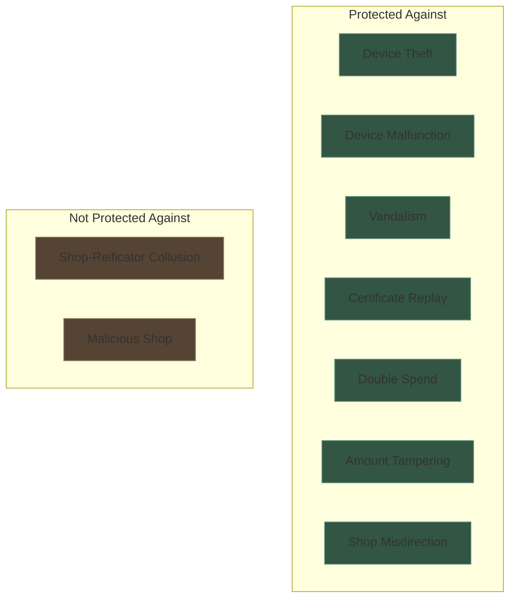
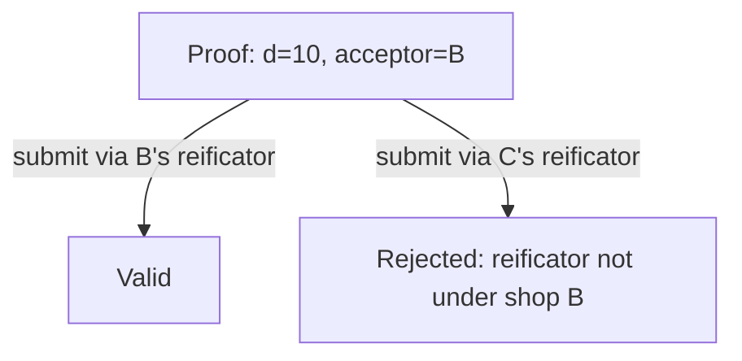
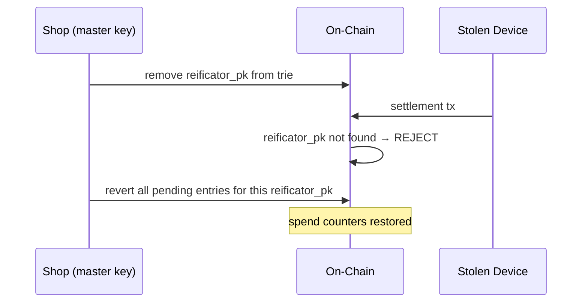
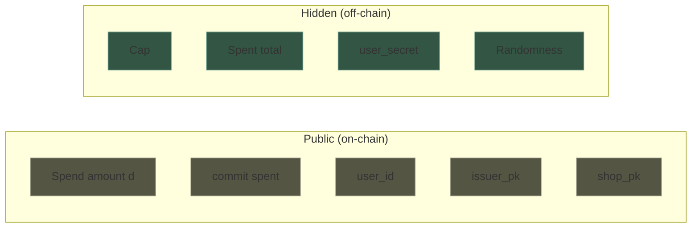

# Security

## Threat Model

The protocol protects against **device failure** — malfunction, theft, vandalism. It does **not** protect against malicious shops. The shop is assumed cooperative: it has every incentive to serve its customers.

## Cryptographic Guarantees

### What requires a ZK proof?

Operations where **private data must remain hidden** while proving a statement about it.

| Assertion | Private inputs | Mechanism |
|-----------|---------------|-----------|
| `s_old + d ≤ cap` | `s_old`, `cap`, randomness | ZK proof (Groth16) |
| Certificate is valid (issuer signed it) | `cap`, `nonce` | ZK proof (EdDSA verified inside circuit) |
| User is who they claim | `user_secret` | ZK proof (`user_id = Poseidon(user_secret)`) |

### What requires only a signature?

Operations where **authorization** is needed but nothing is hidden.

| Assertion | Signer | Mechanism |
|-----------|--------|-----------|
| "User X may spend up to cap C" | Shop (issuer) | EdDSA signature (verified inside ZK circuit) |
| "Amount d settled, nonce N" | Reificator | EdDSA signature (verified at redemption) |
| "Nonce N is redeemed" | Reificator | Transaction signature |
| "Nonce N is reverted" | Shop (master key) | Transaction signature |
| "Reificator R is authorized" | Shop | On-chain trie entry |

### What needs no cryptography?

| Operation | Why |
|-----------|-----|
| Topup | Off-chain certificate, signed by shop key already on the device |
| Casher acknowledges discount | Physical act, no cryptographic role |

## Attack Analysis

### Double spend

**Attack**: Customer presents the same spend proof to two different reificators simultaneously.

**Defense**: The ZK proof binds the acceptor's public key (the `shop_pk` of the shop where the spend happens). Each proof targets one acceptor. The on-chain validator checks the submitting reificator belongs to that shop. Two different acceptors = two different proofs needed = two different counter updates.

### Amount tampering

**Attack**: Reificator changes the spend amount `d` before submitting.

**Defense**: `d` is a public input to the ZK proof. Changing `d` invalidates the proof. The on-chain Groth16 verifier rejects it.

### Certificate replay

**Attack**: Customer presents the same reification certificate twice.

**Defense**: Each certificate carries a nonce. The nonce maps to a pending trie entry on-chain. On first redemption, the entry is removed. On second presentation, the Merkle membership proof fails — the nonce is no longer in the trie.

### Shop misdirection

**Attack**: Reificator from shop A submits a proof intended for shop B.

**Defense**: The proof includes the `acceptor_pk` (the spending shop's `shop_pk`) as a public input. The validator checks the reificator trie: is this `reificator_pk` registered under `acceptor_pk`? If not, the transaction is rejected.

### Stolen reificator

**Attack**: Someone steals a reificator and tries to use it.

**Defense**: The stolen device can submit transactions (it has keys), but:

1. The shop revokes the reificator's public key from the on-chain trie.
2. After revocation, no settlement tx from this device is accepted (trie lookup fails).
3. The shop reverts all pending entries for the stolen reificator using its master key.
4. Customer spend counters are restored.

### Reificator malfunction

**Attack**: Device settles a proof on-chain but crashes before returning the reification certificate.

**Defense**: The pending trie entry exists on-chain — evidence that the settlement happened. The customer contacts the shop. The shop checks the pending trie, sees the unredeemed entry, and reverts it with the master key. Customer's counter is restored.

### Phone loss

**Impact**: All certificates lost. `user_secret` lost.

**Defense**: None — this is a total loss, same as losing a crypto wallet seed. The user should back up `user_secret` (it's one field element, encodable as a passphrase).

On-chain state persists (spend counters), but without `user_secret` the user cannot generate new proofs. The spent points are unrecoverable.

## Privacy Properties

| Observer | Learns | Does not learn |
|----------|--------|---------------|
| On-chain observer | `d`, `user_id`, `issuer_pk`, `acceptor_pk`, `commit(spent)` | Cap, actual spent total, balance, user identity |
| Issuer (shop that signed the cap) | Cap they signed, user_id | Other shops' caps, total spent, when/where redeemed |
| Acceptor (shop where the spend happens) | Amount `d` being redeemed | Cap, total spent, which shop issued the certificate |
| Data provider | Trie structure, entry existence | Nothing beyond what's on-chain |
