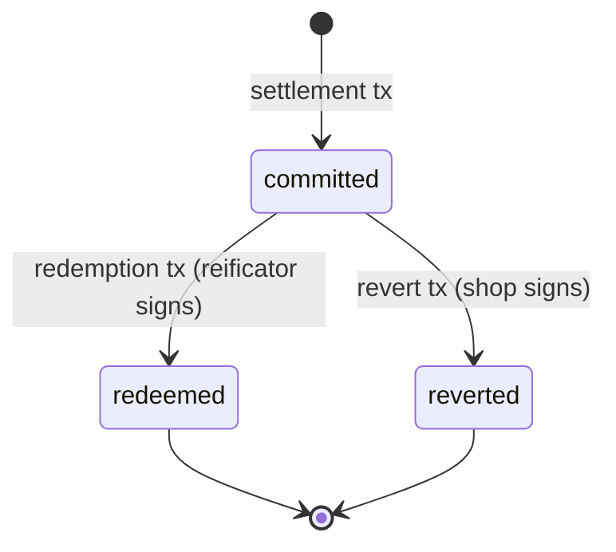

# Semantics

Precise definitions for every term in the protocol. Each definition is self-contained — no circular references.

## Primitive Concepts

**Field element**
:   An integer in the BLS12-381 scalar field: `0 ≤ x < q` where `q = 52435875175126190479447740508185965837690552500527637822603658699938581184513`.

**Commitment**
:   `commit(v, r) = Poseidon(v, r)` — a binding, hiding hash of value `v` with randomness `r`. Given `commit(v, r)`, no one can determine `v` without `r`. Given `v` and `r`, anyone can verify `commit(v, r)`.

**User secret**
:   A random field element chosen once by the user's phone. Never leaves the phone. The user's entire identity derives from this value.

**User ID**
:   `user_id = Poseidon(user_secret)` — the public identity of a user. Appears on-chain. Cannot be reversed to recover `user_secret`.

## Certificates

**Cap certificate**
:   A signed statement: "user `user_id` may spend up to `cap` points from this issuer." Signed by the issuer's shop key (EdDSA on Jubjub). Lives on the user's phone. Never published on-chain.

    Formally: `(user_id, cap, signature)` where `signature = EdDSA.sign(shop_key, Poseidon(user_id, cap))`.

**Reification certificate**
:   A signed statement: "amount `d` was settled on-chain with nonce `N`, redeemable at this reificator." Signed by the reificator key. Lives on the user's phone.

    Formally: `(d, nonce, signature)` where `signature = EdDSA.sign(reificator_key, (d, nonce))`.

## Actors

**Coalition**
:   The entity that creates the on-chain state, manufactures reificators, and registers shops. Minimal authority — cannot touch user funds or alter spend state. The only destructive action (removing a shop) requires multi-signature from other shops.

**Shop**
:   A business in the coalition. Has a key pair (`shop_pk`, `shop_sk`). Issues cap certificates (topup). Holds a master key separately from its devices. Can revert pending entries for its reificators.

**Reificator**
:   A stateless hardware device at a cashing point. Contains two burned-in keys (reificator key from coalition, shop key from shop) and a Cardano payment key. Settles proofs on-chain, signs reification certificates, displays amounts for cashers. All state is on-chain.

**Casher**
:   The human operator at the cashing point. Sees the reified amount, applies discounts, sets topup amounts. No cryptographic role — interacts only through the reificator's screen.

**User**
:   A customer with a phone. Holds `user_secret`, cap certificates, reification certificates, and spend randomness. Generates ZK proofs. Fully anonymous — no registration, no account, no wallet.

**Data provider**
:   An untrusted service that serves Merkle proofs from the off-chain trie data. Verified against the on-chain trie root. Anyone can run one. Paid per query by reificators.

## Operations

**Topup**
:   The casher awards loyalty points to a user. The reificator signs a new cap certificate with a higher cap. **No on-chain transaction.** This is the high-frequency, low-value event.

    ```mermaid
    sequenceDiagram
        participant C as Casher
        participant R as Reificator
        participant P as Phone
        C->>R: set reward amount
        R->>R: sign cap certificate (shop_key)
        R->>P: cap certificate
        Note over P: stores certificate locally
    ```

**Settlement**
:   The reificator submits a user's ZK proof on-chain. The spend trie counter goes up. A pending entry is created in the pending trie. Happens asynchronously — the user is at home.

    ```mermaid
    sequenceDiagram
        participant P as Phone
        participant R as Reificator
        participant DP as Data Provider
        participant M as MPFS
        participant L1 as L1 (Trie Root)
        P->>R: ZK proof (binds d + shop_pk)
        R->>DP: request Merkle proof for user_id
        DP->>R: Merkle proof
        R->>M: settlement request (proof + Merkle proof)
        M->>L1: settlement tx (atomic trie update)
        L1->>L1: spend trie: counter += d
        L1->>L1: pending trie: insert (reificator, nonce, user_id, d)
        R->>P: reification certificate (nonce, d, reificator_sig)
    ```

**Reification**
:   The act of exposing a settled spend to the physical world. The reificator's screen lights up and the casher sees the amount. This is not a transaction — it is a physical event triggered by verifying that a pending entry exists on-chain.

    ```mermaid
    sequenceDiagram
        participant P as Phone
        participant R as Reificator
        participant DP as Data Provider
        P->>R: reification certificate
        R->>R: verify own signature
        R->>DP: Merkle proof for nonce in pending trie
        DP->>R: proof (exists)
        R->>R: screen lights up: "€X.XX"
    ```

**Redemption**
:   The casher acknowledges the reified amount and applies the discount. The pending entry is removed from the trie. This is the second on-chain transaction per spend.

    ```mermaid
    sequenceDiagram
        participant C as Casher
        participant R as Reificator
        participant M as MPFS
        participant L1 as L1 (Trie Root)
        C->>R: acknowledge discount
        R->>M: redemption request (nonce, reificator_sig)
        M->>L1: redemption tx
        L1->>L1: pending trie: remove entry
    ```

**Revert**
:   The shop reverses a committed-but-unredeemed spend. The pending entry is removed and the spend counter is rolled back. Only the shop's master key can authorize this. Used after device loss, theft, or malfunction.

    ```mermaid
    sequenceDiagram
        participant S as Shop (master key)
        participant M as MPFS
        participant L1 as L1 (Trie Root)
        S->>M: revert request (nonce, shop_sig)
        M->>L1: revert tx
        L1->>L1: pending trie: remove entry
        L1->>L1: spend trie: counter -= d
    ```

## State Transitions

Every spend goes through a lifecycle:



- **committed → redeemed**: the happy path. Device confirms physical redemption.
- **committed → reverted**: recovery path. Shop reverses after device failure.

Both terminal states remove the pending entry from the trie. Only the redeemed path keeps the spend counter elevated. The reverted path rolls it back.
