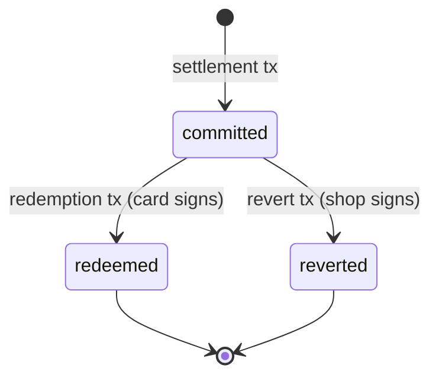

# Semantics

Precise definitions for every term in the protocol. Each definition is self-contained — no circular references.

## Primitive Concepts

**Field element**
:   An integer in the BLS12-381 scalar field: `0 ≤ x < q` where `q = 52435875175126190479447740508185965837690552500527637822603658699938581184513`.

**Commitment**
:   `commit(v, r) = Poseidon(v, r)` — a binding, hiding hash of value `v` with randomness `r`. Given `commit(v, r)`, no one can determine `v` without `r`. Given `v` and `r`, anyone can verify `commit(v, r)`.

**User secret**
:   A random field element chosen once by the user's phone. Never leaves the phone. The user's entire identity derives from this value.

**User ID**
:   `user_id = Poseidon(user_secret)` — the public identity of a user. Appears on-chain. Cannot be reversed to recover `user_secret`.

## Certificates

**Cap certificate**
:   A signed statement: "user `user_id` may spend up to `cap` points from this issuer." Signed by the issuer card's Jubjub EdDSA key (verified inside the ZK circuit where `cap` is private). Lives on the user's phone. Never published on-chain.

    Formally: `(user_id, cap, signature)` where `signature = EdDSA.sign(card_jubjub_key, Poseidon(user_id, cap))`.

**Reification certificate**
:   A signed statement: "amount `d` was settled on-chain with nonce `N`, redeemable at a reificator with this card inserted." Signed by the card's Ed25519 key. Lives on the user's phone.

    Formally: `(d, nonce, signature)` where `signature = Ed25519.sign(card_ed25519_key, (d, nonce))`.

## Actors

**Coalition**
:   The entity that creates the on-chain state, manufactures cards, registers shops, and operates MPFS for certificate anchoring. Minimal authority — cannot touch user funds or alter spend state. The only destructive action (removing a shop) requires multi-signature from other shops. The coalition signs certificate batches but cannot forge certificates (it lacks shop Jubjub keys).

**Shop**
:   A business in the coalition. Holds a master key (never on a device) for reverting pending entries. Receives cards from the coalition. Inserts a card into the reificator to activate it. Spare cards kept in a safe.

**Card**
:   A PIN-protected smart card with a secure element. Holds two key pairs: Jubjub EdDSA (signs cap certificates, verified in ZK circuit) + Ed25519 (signs Cardano transactions and reification certificates, verified by Plutus validator). The card is the shop's complete identity. Distributed by the coalition, registered on-chain as a (jubjub_pk, ed25519_pk) pair under a shop.

**Reificator**
:   A stateless commodity hardware device at a cashing point. Has no keys of its own — it is a dumb terminal with a screen, network interface, and card slot. Holds only a Cardano payment key + UTXO for fees. All signing is delegated to the inserted card. Without a card, the reificator is inert. Interchangeable — a shop's card works in any compatible reificator. Submits topup intents and L1 transaction requests to MPFS.

**Casher**
:   The human operator at the cashing point. Sees the reified amount, applies discounts, sets topup amounts. No cryptographic role — interacts only through the reificator's screen.

**User**
:   A customer with a phone. Holds `user_secret`, Ed25519 keypair (`sk_c`, `pk_c`), cap certificates, reification certificates, and spend randomness. Generates ZK proofs. Fully anonymous — no registration, no account, no wallet.

**Data provider**
:   An untrusted service that serves Merkle proofs from the off-chain trie data (spend trie, pending trie, and certificate MPF). All are SHA-256 MPF, verified against the on-chain roots. Anyone can run one. Paid per query by reificators.

## Operations

**Topup**
:   The casher awards loyalty points to a user. Two things happen: (1) the card signs a new cap certificate (Jubjub EdDSA) with a higher cap and gives it to the user's phone, and (2) the reificator submits a topup intent to MPFS, which validates and batches the certificate anchor into the certificate MPF. This is the high-frequency, low-value event. **Requires the card to be inserted** — the reificator alone cannot issue certificates or sign intents.

    ```mermaid
    sequenceDiagram
        participant C as Casher
        participant R as Reificator + Card
        participant P as Phone
        participant MPFS as MPFS
        C->>R: set reward amount
        R->>R: card signs cap certificate (Jubjub EdDSA)
        R->>P: cap certificate
        R->>R: card signs topup intent (Ed25519)
        R->>MPFS: topup intent
        MPFS->>MPFS: validate + batch MPF insert
        MPFS->>R: coalition batch receipt (signed)
        R->>P: batch receipt
        Note over P: stores certificate + receipt
    ```

    The cap certificate is spendable on L1 once the batch is included in the next certificate root update.

**Settlement**
:   The reificator (with card inserted) submits a user's ZK proof on-chain. The card's Ed25519 key signs the transaction. The spend trie counter goes up. A pending entry is created in the pending trie. Happens asynchronously — the user is at home.

    ```mermaid
    sequenceDiagram
        participant P as Phone
        participant R as Reificator + Card
        participant DP as Data Provider
        participant M as MPFS
        participant L1 as L1 (Trie Root)
        P->>R: ZK proof + Ed25519 signature (binds d + acceptor_pk + TxOutRef)
        R->>DP: request Merkle proof for user_id
        DP->>R: Merkle proof
        R->>M: settlement request (proof + Merkle proof, signed by card's Ed25519)
        M->>L1: settlement tx (atomic trie update)
        L1->>L1: spend trie: counter += d
        L1->>L1: pending trie: insert (card_ed25519_pk, nonce, user_id, d)
        R->>P: reification certificate (nonce, d, card_ed25519_sig)
    ```

**Reification**
:   The act of exposing a settled spend to the physical world. The reificator's screen lights up and the casher sees the amount. This is not a transaction — it is a physical event triggered by verifying that a pending entry exists on-chain.

    ```mermaid
    sequenceDiagram
        participant P as Phone
        participant R as Reificator
        participant DP as Data Provider
        P->>R: reification certificate
        R->>R: verify card's Ed25519 signature
        R->>DP: Merkle proof for nonce in pending trie
        DP->>R: proof (exists)
        R->>R: screen lights up: "€X.XX"
    ```

**Redemption**
:   The casher acknowledges the reified amount and applies the discount. The pending entry is removed from the trie. This is the second on-chain transaction per spend.

    ```mermaid
    sequenceDiagram
        participant C as Casher
        participant R as Reificator
        participant M as MPFS
        participant L1 as L1 (Trie Root)
        C->>R: acknowledge discount
        R->>M: redemption request (nonce, card_ed25519_sig)
        M->>L1: redemption tx
        L1->>L1: pending trie: remove entry
    ```

**Revert**
:   The shop reverses a committed-but-unredeemed spend. The pending entry is removed and the spend counter is rolled back. Only the shop's master key can authorize this. Used after device loss, theft, or malfunction.

    ```mermaid
    sequenceDiagram
        participant S as Shop (master key)
        participant M as MPFS
        participant L1 as L1 (Trie Root)
        S->>M: revert request (nonce, shop_sig)
        M->>L1: revert tx
        L1->>L1: pending trie: remove entry
        L1->>L1: spend trie: counter -= d
    ```

## Certificate Anchoring

**Certificate MPF**
:   A SHA-256 Merkle Patricia Forestry tree managed off-chain by MPFS. Contains all anchored certificates, keyed by `(issuer_jubjub_pk, user_id)` with value `certificate_id`. Updated by MPFS as it processes topup intent batches. The root is periodically posted to L1 as a reference input.

**Certificate ID**
:   `certificate_id = Poseidon(user_id, cap)` — the key used to anchor a certificate in the MPF. This value is computed by the ZK circuit and exposed as public input index 8. The binding between `certificate_id` and the actual cap is enforced by the circuit, not by the on-chain validator (Poseidon is not available on-chain).

**Certificate root**
:   The SHA-256 MPF root stored in a reference-input UTxO on L1. Settlement transactions include an MPF membership proof for `certificate_id` against this root. Updated periodically by the coalition via a certificate root update transaction.

**Certificate root update**
:   An L1 transaction that updates the certificate root UTxO with a new MPF root. Submitted by the coalition after processing one or more batches. The previous root remains active until the update tx confirms — no gap in service.

**IPFS changeset**
:   A JSON document published to IPFS for each batch (or group of batches). Contains all topup entries, each independently verifiable against L1: `(issuerJubjubPk, userId, certificateId, cardEd25519Pk, batchNumber)`. Replaying all entries from `previousRoot` must produce `newRoot`.

**Coalition batch receipt**
:   The coalition's signature over `(batchNumber, previousRoot, newRoot, entries)`. Given to the user's phone via the reificator as proof that the coalition committed to including their topup. If the L1 root doesn't reflect a signed batch, the user has cryptographic evidence of fraud. Enforcement is off-chain (business/legal).

## State Transitions

Every spend goes through a lifecycle:



- **committed → redeemed**: the happy path. Device confirms physical redemption.
- **committed → reverted**: recovery path. Shop reverses after device failure.

Both terminal states remove the pending entry from the trie. Only the redeemed path keeps the spend counter elevated. The reverted path rolls it back.
